# WEARABLE PATIENT MONITOR  
  
This prototype is a proof of concept for a connected wearable patient monitor capable of measuring oximetry parameters, 
body temperature and track the patient's movement, while transmitting data wirelessly via LoRa communication.  
  
It is based on the [Nucleo WL55JC1](https://www.st.com/en/evaluation-tools/nucleo-wl55jc.html) 
([STM32WL55JC](https://www.st.com/en/microcontrollers-microprocessors/stm32wl55jc.html) from ST Microelectronics), 
Maxim (now Analog Devices) [MAX30102](https://www.analog.com/en/products/max30102.html) pulse oximetry sensor, 
Würth Elektronik [WSEN-ISDS](https://www.we-online.com/en/components/products/WSEN-ISDS) 6-DOF IMU, 
an OLED display and a buzzer for simple audio generation.  
  
The device features LoRa connection, allowing it to be used in remote locations where telecommunications infrastructure is not well established.

## MOTIVATION

Many patients in need of medical assistance could be treated more comfortably at home, but monitoring their condition in a timely manner could be a challenge, especially if they live in rural areas.  
  
The goal of this project is to develop a low power, wirelessly connected, wearable device to monitor patient heart rate, oximetry, respiration rate, temperature and estimate overall condition. The device would include a microcontroller that manages sensors (such as optical, thermal, inertial, etc.) and connects to an IoT network such as LoRaWAN. A rechargeable battery would also be present, as well as the corresponding power management IC.  
  
The NUCLEO-WL55JC would be a great platform for prototyping such device, since it provides the sub-GHz radio and full access to the MCU pins. Sensors and other hardware parts can be integrated using I2C and SPI communication, and are generally available in breakout boards for easy development.  
  
This kind of device enables caregivers and physicians to monitor their patients remotely and gather information continuously. The data collected can also be processed autonomously using AI to detect potential degradation of patient’s condition and triggering alarms, while simpler analysis could be done directly by the IoT device (edge computing).  
  
The benefits of the device go beyond patient’s health. The overall treatment cost could be lowered since caregivers and physicians could focus attention on the most critical patients more often, and more stable patients can be visited more sporadically.  
  
## HARDWARE

### Prototype  
  
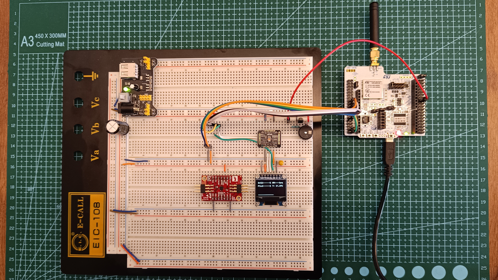

  
**Connections (CubeMX):**  
  
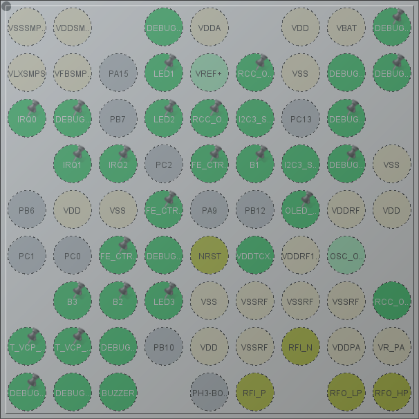

Pinout table for connection between the Nucleo board 
([Nucleo WL55JC1 schematic](https://www.st.com/resource/en/schematic_pack/mb1389-wl55jc-highband-e02_schematic.pdf)) 
and other components on the breadboard:

| **Nucleo WL55JC1** | **MCU Pin**    | **Peripheral**   | **Signal**    |
|:------------------:|:--------------:|:----------------:|:-------------:|
| CN7 Pin 16         | VDD            | -                | +3.3V         |
| CN7 Pin 18         | -              | -                | +5.0V         |
| CN7 Pin 20         | VSS            | -                | GND           |
| CN7 Pin 22         | VSS            | -                | GND           |
| CN7 Pin 28         | PB1            | GPIO             | OLED_RESET    |
| CN7 Pin 36         | PB14           | I2C3 SDA         | I2C SDA       |
| CN7 Pin 38         | PB13           | I2C3 SCL         | I2C SCL       |
| CN10 Pin 16        | PA8            | TIM1 CH1 PWM Out | BUZZER        |
  

### LoRa Receiver  

A very simple LoRa receiver was assembled using a [LoRa module](https://www.nicerf.com/lora-module/sx1276-lora-module-lora1276.html) from [G-NiceRF](https://www.nicerf.com/), 
which is based on the [SX1276](https://www.semtech.com/products/wireless-rf/lora-connect/sx1276) chip from [Semtech](https://www.semtech.com/), and a BluePill board, which is based on ST Microelectronics STM32F103.    
The software running on the BluePill is a slightly modified version of [arduino-LoRa-STM32](https://github.com/armtronix/arduino-LoRa-STM32) that was developed by [ARMtronix Technologies](https://github.com/armtronix).

**LoRa module:**  

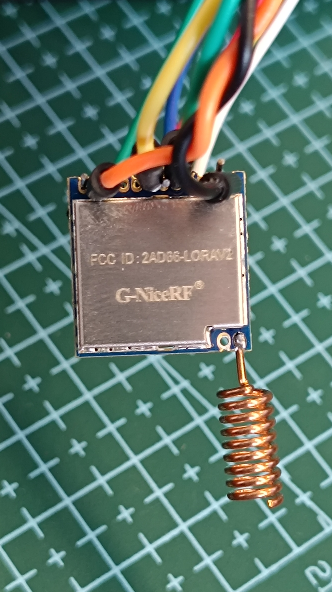  
  
More information about how to make this receiver can be found on this [video](https://www.youtube.com/watch?v=A0RhP0SkhkQ&ab_channel=HowToElectronics) 
and [arcticle](https://how2electronics.com/interfacing-lora-sx1276-with-stm32-microcontroller-lr1276-915mhz/) from [How To Electronics](https://how2electronics.com/).

**Receiver:**  
  
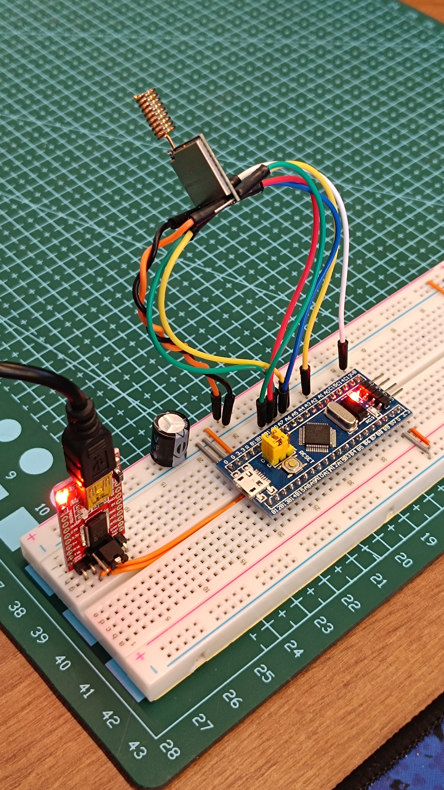  
  
The software modifications made were necessary to match the radio configurations on the STM32WL55:  
- Frequency: 915 MHz  
- Bandwidth: 500 kHz  
- Spreading Factor: 11  

Pinout connections for LoRa receiver (white cable of previous image is not connected):  

| **STM32F103C6** | **SX1276 MODULE** | **FTDI MODULE** |
|:---------------:|:-----------------:|:---------------:|
| GND             | GND               | GND             |
| +3.3V           | VCC               | VCC             |
| PA4             | NSS               | -               |
| PA1             | DIO0              | -               |
| PA5             | SCK               | -               |
| PA6             | MISO              | -               |
| PA7             | MOSI              | -               |
| PA9             | -                 | RX              |
| PA10            | -                 | TX              |
| PB0             | RST               | -               |
  
## SOFTWARE  
  
### Software initialization

As the software starts, 3 opening screens are shown:

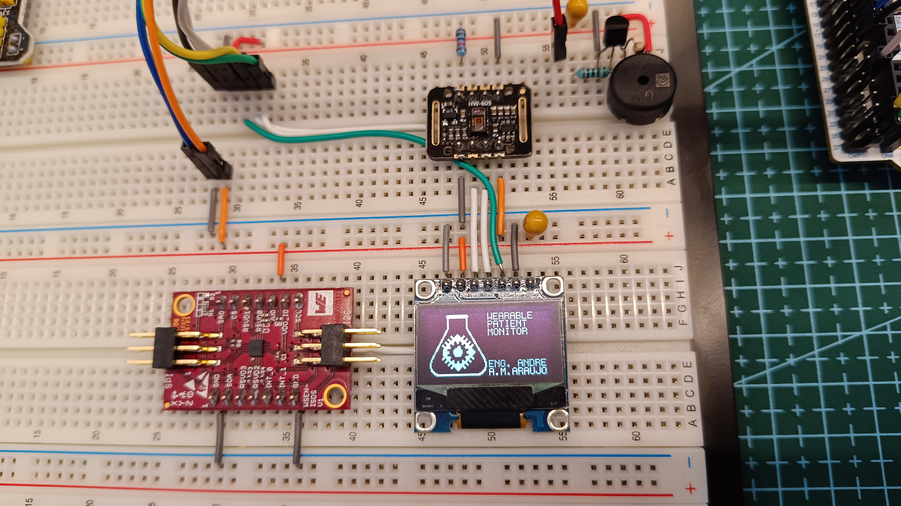  
  
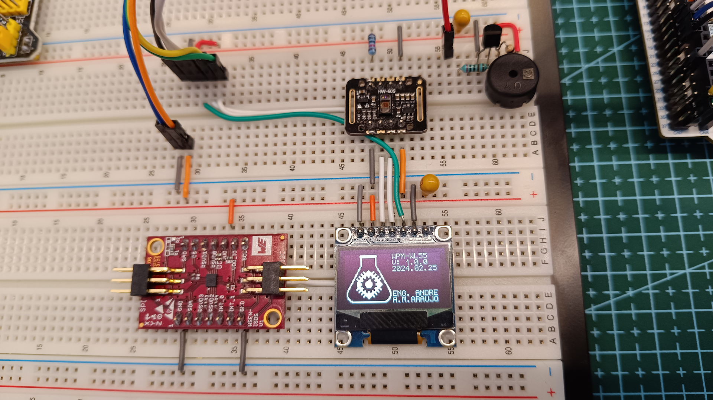  
  
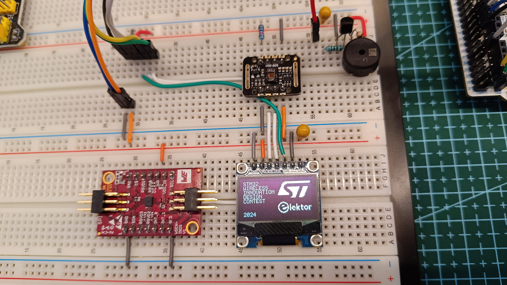  

The device also prints data via its serial port. After initialization information, the device continuously transmits raw data from sensors at a rate of 30 Hz.
This trnasmission can only be done while the USB cable is connected to the Nucleo board, so it is available mainly for development and debugging purposes. 

**Console:**  
  
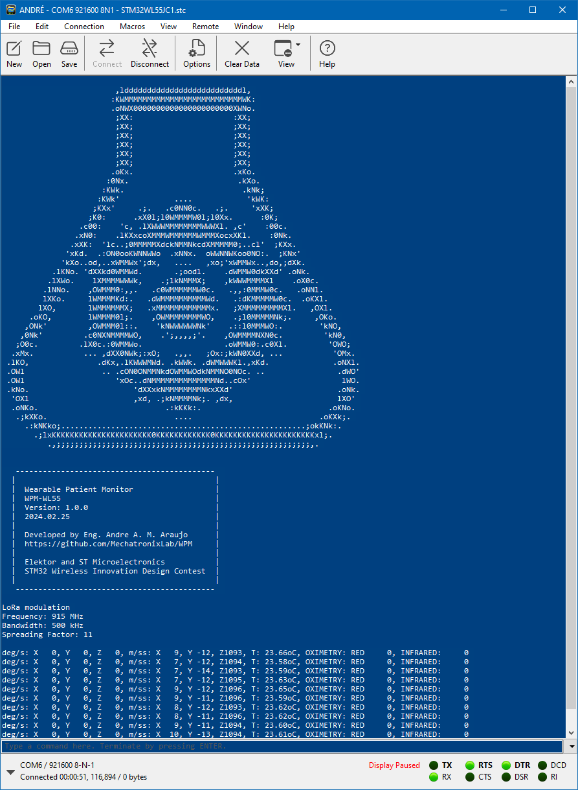    

Using the [Serial Oscilloscope](https://x-io.co.uk/serial-oscilloscope/) tool from [x-io Technologies](https://x-io.co.uk/), it is possible to plot the raw data transmitted from the prototype in real time:
  
**Gyroscope raw data:**  
  
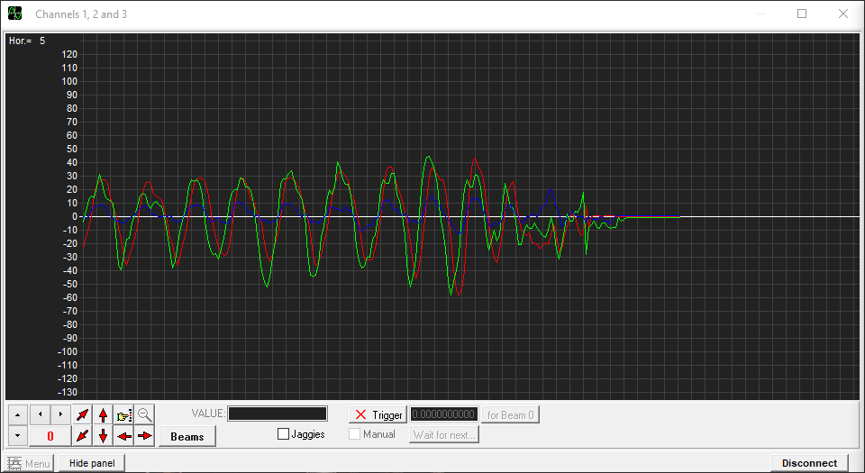  
  
**Accelerometer raw data:**  
  
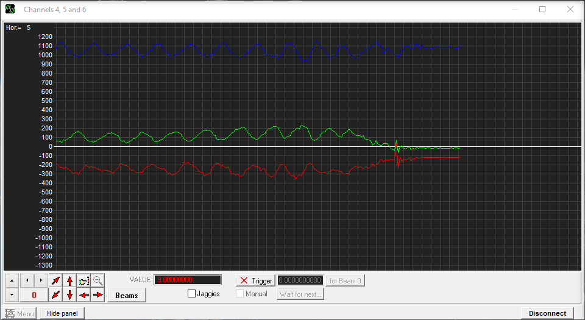  

**Oximetry raw data:**  
  
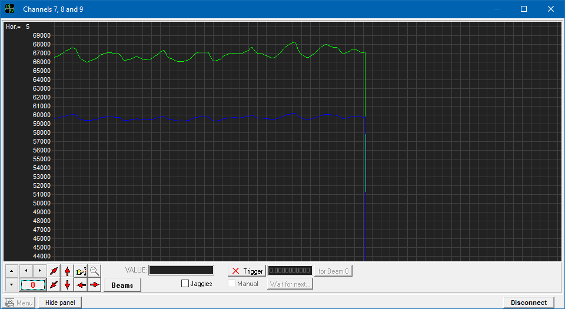  

### LoRa Receiver
  
The receiver simply relays data from the LoRa module to the UART, which is then converted to USB and captured by a computer.  

**Received data via LoRa:**  
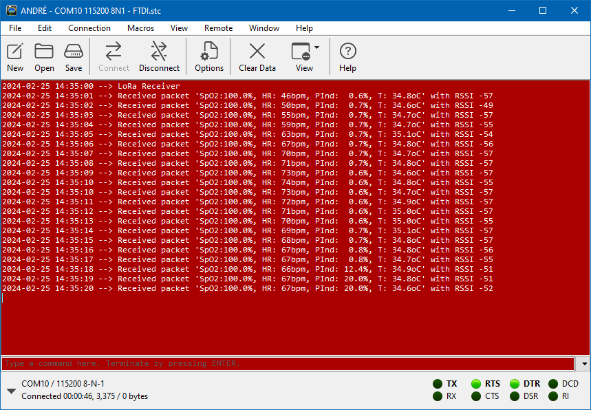  

  
## Acknowledgements  
  
[**Fabio Souza**](https://github.com/FBSeletronica) and [**Halysson Jr**](https://github.com/halyssonjr) @ [Franzininho](https://github.com/Franzininho)  
**William Maia** and **Daniel Botelho** @ [ST Microelectronics](https://github.com/stmicroelectronics) Brazil  
**Fabio Costa** and **Érico Hassegawa** @ [Würth Elektronik](https://github.com/WurthElektronik) Brazil  
**Matt Mielke** @ DigiKey, for writing [this arcticle](https://forum.digikey.com/t/using-the-low-level-sub-ghz-radio-driver-for-the-stm32wl-series/18253) explaining how to use the Sub-GHz module on the STM32WL55  
[**Elektor Magazine**](https://www.elektormagazine.com/) and [**ST Microelectronics**](https://github.com/stmicroelectronics), for promoting the [STM32 Wireless Innovation Design Contest](https://www.elektormagazine.com/st-contest)  
